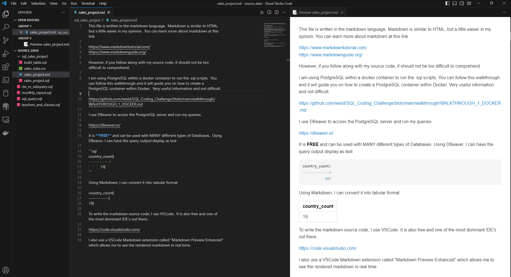

This file is written in the markdown language.  Markdown is similar to HTML, but a little easier in my opinion.  You can learn more about markdown at this link

https://www.markdowntutorial.com/

https://www.markdownguide.org/

However, if you follow along with my source code, if should not be too difficult to comprehend.

I am using PostgreSQL within a docker container to run the .sql scripts.  You can follow this walkthrough and it will guide you on how to create a PostgreSQL container within Docker.  Very useful information and not difficult.

https://github.com/iweld/SQL_Coding_Challenge/blob/main/walkthrough/WALKTHROUGH_1_DOCKER.md

I use DBeaver to access the PostgreSQL server and run my queries.

https://dbeaver.io/

It is **FREE** and can be used with MANY different types of Databases.  Using DBeaver, I can have the query output display as text

```sql
country_count|
-------------+
           19|
```

Using Markdown, I can convert it into tabular format

country_count|
-------------|
19|

To write the markdown source code, I use VSCode.  It is also free and one of the most dominant IDE's out there.

https://code.visualstudio.com/

I also use a VSCode Markdown extension called "Markdown Preview Enhanced" which allows me to see the rendered markdown in real time.



So I will normally have a my_queries.sql file to show the actual queries and I will have a separate my_queries.md file to display the page in a cleaner format.

When you want to show actual code in mark down, you have to enclose your code like so...

````markdown
```sql
	select * 
	from some_table;
```
````

This will allow your SQL code (or any code for that matter) to render with syntax highlighting like so...

```sql
	select * 
	from some_table;
```

I will use the first couple of queries from the sql file to give an example.

**1.** Show a sample of the data.

```sql
	SELECT *
	FROM 
		sales_project.sales_data
	LIMIT 5;
```

ordernumber|quantityordered|priceeach|orderlinenumber|sales  |orderdate |status |qtr_id|month_id|year_id|productline|msrp  |productcode|customername      |phone     |addressline1           |addressline2|city    |state |postalcode|country|territory|contactlastname|contactfirstname|dealsize|
-----------|---------------|---------|---------------|-------|----------|-------|------|--------|-------|-----------|------|-----------|------------------|----------|-----------------------|------------|--------|------|----------|-------|---------|---------------|----------------|--------|
10146|             47|    67.14|              2|3155.58|2003-09-03|Shipped|     3|       9|   2003|Motorcycles|    62|S18_3782   |Gift Ideas Corp.  |2035554407|2440 Pompton St.       |[NULL]      |Glendale|CT    |97561     |USA    |NA       |Lewis          |Dan             |Medium  |
10237|             27|      100|              5|3113.64|2004-04-05|Shipped|     2|       4|   2004|Motorcycles|   102|S32_4485   |Vitachrome Inc.   |2125551500|2678 Kingston Rd.      |Suite 101   |NYC     |NY    |10022     |USA    |NA       |Frick          |Michael         |Medium  |
10414|             27|    90.37|              8|2439.99|2005-05-06|On Hold|     2|       5|   2005|Ships      |    99|S700_3962  |Gifts4AllAges.com |6175559555|8616 Spinnaker Dr.     |[NULL]      |Boston  |MA    |51003     |USA    |NA       |Yoshido        |Juri            |Small   |
10107|             30|     95.7|              2|   2871|2003-02-24|Shipped|     1|       2|   2003|Motorcycles|    95|S10_1678   |Land of Toys Inc. |2125557818|897 Long Airport Avenue|[NULL]      |NYC     |NY    |10022     |USA    |NA       |Yu             |Kwai            |Small   |
10121|             34|    81.35|              5| 2765.9|2003-05-07|Shipped|     2|       5|   2003|Motorcycles|    95|S10_1678   |Reims Collectables|26.47.1555|59 rue de l'Abbaye     |[NULL]      |Reims   |[NULL]|51100     |France |EMEA     |Henriot        |Paul            |Small   |

**2.** NUMBER OF COUNTRIES IN WHICH WERE TAKING PLACE

```sql
	SELECT 
	COUNT(DISTINCT(COUNTRY)) AS country_count
FROM 
	sales_project.sales_data;
```

country_count|
-------------|
19|

**3.** DIFFERENT TYPES OF ORDER STATUSES AND THEIR COUNT

```sql
	SELECT DISTINCT
		STATUS AS types_of_statuses,
		count(*) AS status_count
	FROM 
		sales_project.sales_data
	GROUP BY
		status;
```

types_of_statuses|status_count|
-----------------|------------|
Cancelled        |          60|
Disputed         |          14|
In Process       |          41|
On Hold          |          44|
Resolved         |          47|
Shipped          |        2617|

As you can see, I have to copy the SQL code **AND** results and paste it onto the markdown file.  This is some extra work, but I think it looks WAY better and it's a great way to showcase your technical abilities.